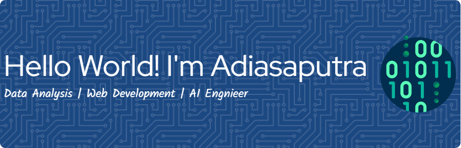

# Hi there, I'm Adiasaputra 👋

  

  <b>AI Engineering Student | Fullstack Developer | Thesis Researcher</b>

---

### ⚡ About Me

- 🔭 **Current Focus**: Working on my thesis research.
- 🌱 **Learning**: Studying to become an AI Engineer, exploring Deep Learning, Machine Learning, and Neural Networks.
- 💬 **Ask me about**: PHP, Laravel, Python, and Web Development.
- 📫 **How to reach me**: Connect with me on [LinkedIn](https://www.linkedin.com/in/adisaputra-marbun) or [Instagram](https://instagram.com/adia_2112).

---

### 🛠️ Tech Stack & Skills

<table>
  <tr>
    <td valign="top" width="50%">
      <h4>🚀 Languages & Frameworks</h4>
      
      
        
      
      
      
      
    </td>
    <td valign="top" width="50%">
      <h4>🤖 AI & Data Science</h4>
      
      
        
      
      
      
    </td>
  </tr>
</table>

---

### 📊 GitHub Stats & Activity

  
  

  

---

### 🤝 Connect with Me

  
  

